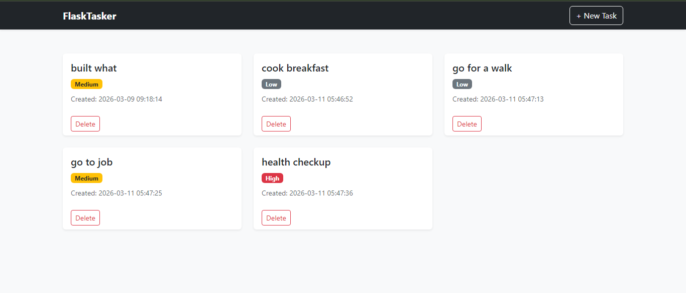

### 🐍 Flask Modern Task Manager

A clean, modern, and fully functional Task Manager built with Flask, SQLite, and Bootstrap 5. This project demonstrates the core concepts of Flask including routing, database integration, templating, and styling.

### ⚡ Features
Create new tasks with specific priorities.
Read and view tasks in a modern card layout.
Delete tasks with confirmation prompts.
Responsive Design using Bootstrap 5.
Flash Messages for user feedback.

### 🚀 Quick Start
Follow these steps to get the application running on your local machine.

1. Clone & Setup Environment
# Create and activate virtual environmentpython -m venv venv# Windowsvenv\Scripts\activate# Mac/Linuxsource venv/bin/activate
2. Install Dependencies
bash

pip install Flask
3. Initialize Database
Run the setup script once to create the database and add sample data.

python init_db.py
4. Run the Application
bash

python app.py
Open your browser and navigate to: http://127.0.0.1:5000

### Licesne
MIT  License
